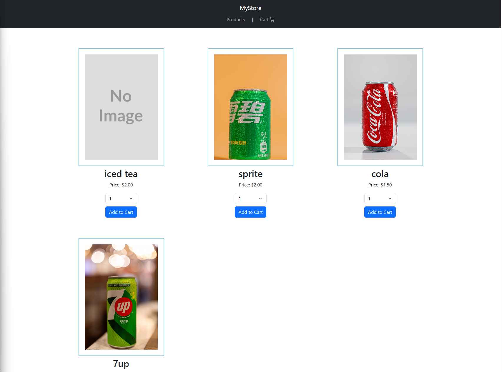
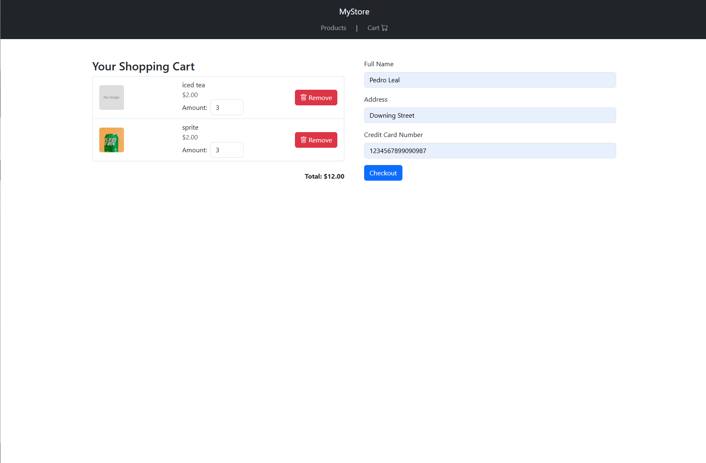
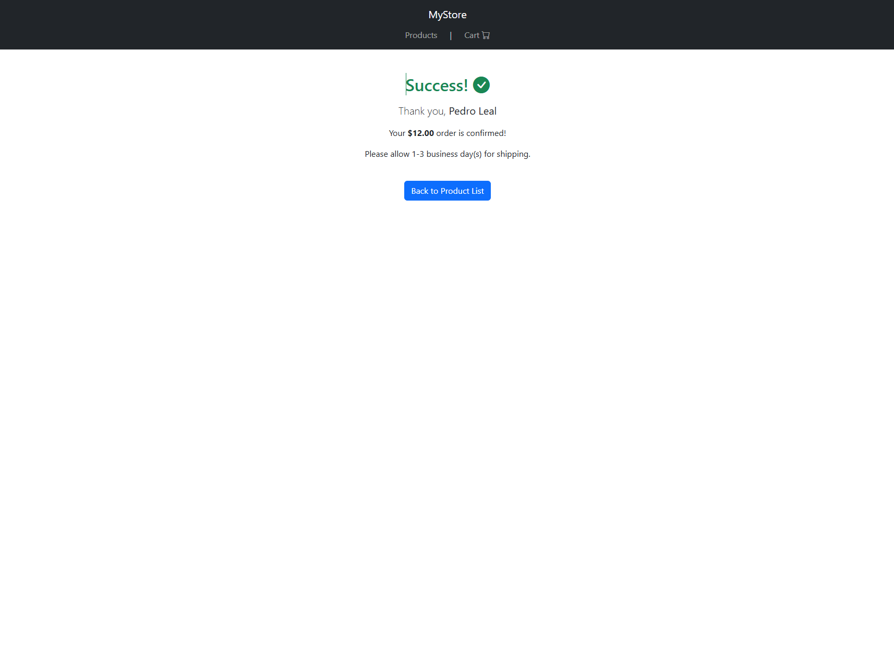

# 🛒 MyStore - Angular E-commerce App

This is **MyStore**, a responsive e-commerce web application built using Angular and Bootstrap. The application is part of the Udacity Full Stack JavaScript Developer Nanodegree and is designed to provide a full shopping experience, from browsing products to completing orders securely.


---

## 🌟 Key Features

- ✅ Browse a product catalog
- 🛒 Add and remove products from a shopping cart
- 📋 Fill in a checkout form with personal and payment details
- ✅ Submit orders securely with backend integration
- 🔐 JWT-based authentication and route protection
- 📄 Order confirmation screen with summary and success message

---

## 📸 Screenshots

### Product Listing



### Cart + Checkout



### Order Confirmation



---

## ⚙️ Backend Integration

This project uses the custom REST API available at:

🔗 [storefront-backend GitHub Repository](https://github.com/pedrole/storefront-backend)

The backend provides:

- JWT authentication
- Endpoints to manage users, products, and orders
- Secure order completion with ownership verification

See:
- [API Requirements](https://github.com/pedrole/storefront-backend/blob/master/REQUIREMENTS.md)
- [API README](https://github.com/pedrole/storefront-backend/blob/master/README.md)

---

## 🚀 Getting Started

### Prerequisites

- Node.js (v18+ recommended)
- Angular CLI (`npm install -g @angular/cli`)
- PostgreSQL (for backend)
- Backend running from [storefront-backend](https://github.com/pedrole/storefront-backend)

---

### 🔧 Installation

1. **Clone the repository**

```bash
git clone https://github.com/pedrole/my-store.git
cd my-store
```

2. **Install depenmdencies**
```bash
npm install
```

3. **Serve the app**
```bash
ng serve
```

### 🖥️ Backend Setup
Clone and follow instructions here:
👉 https://github.com/pedrole/storefront-backend

Make sure the backend is running at http://localhost:3000.

### 🔐 Authentication
 - Login to receive a JWT stored in localStorage
-  Authenticated users can:

   - Add products to cart

   - View cart contents

   - Checkout and complete their order

- Routes like /cart and /order-confirmation are protected

### Scripts

```bash
ng serve         # Dev server at localhost:4200
ng build         # Build production version
ng test          # Run unit tests
```
